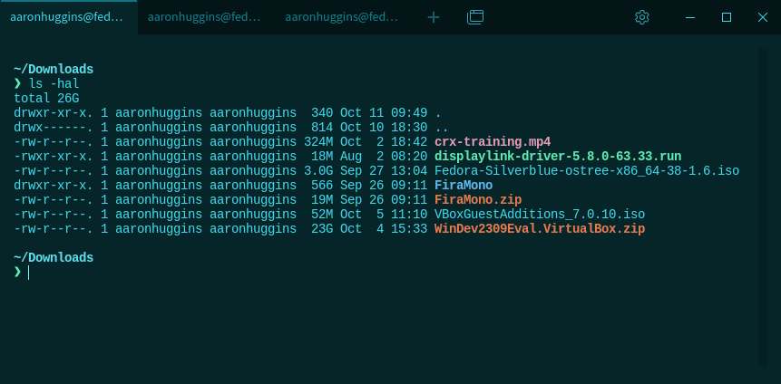
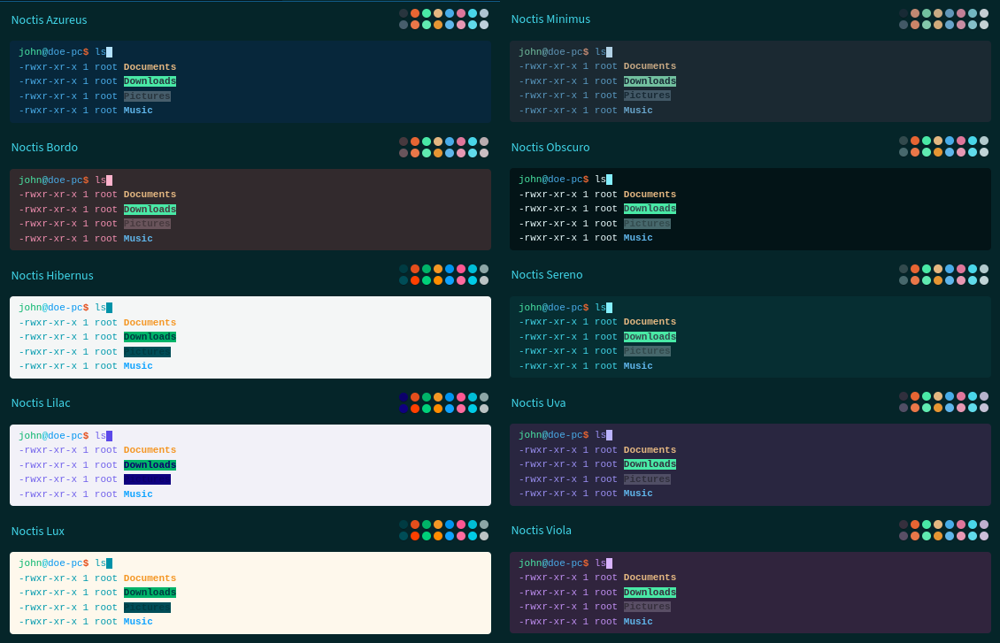

# Noctis Color Schemes

#### For the Tabby terminal

This is a set of color schemes that mimic the [Noctis themes for VSCode](https://github.com/liviuschera/noctis).

## Screenshots

**Noctis color scheme:**



**Noctis color scheme variations:**



---

## Hacking

Clone this repository and run:

```
npm install
```

Start Webpack in the watch mode:

```
npm run watch
```

and your changes to the styles will be rebuilt automatically.

Meanwhile, start Tabby with this plugin included:

```
TABBY_PLUGINS=$(pwd) tabby --debug
```

While Tabby is running, you can reload the plugins by pressing `Ctrl-R` (`Cmd-R` on macOS).

When done, publish your theme to NPM!
